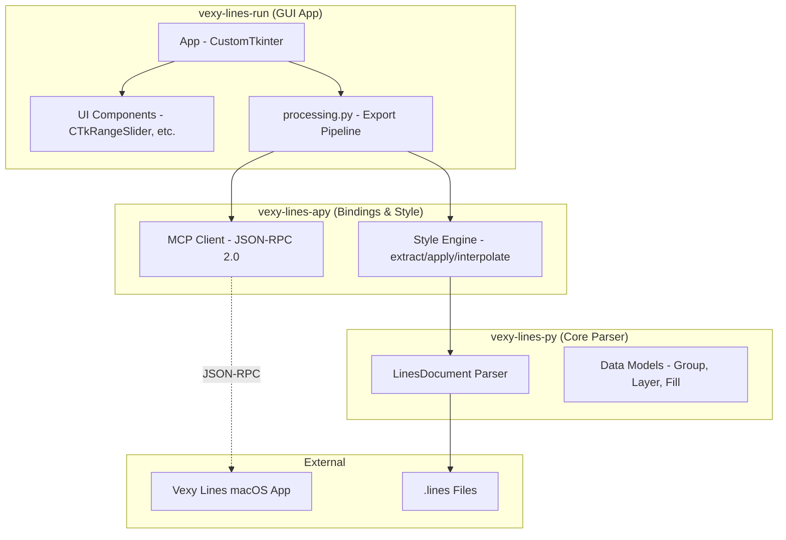

# PLAN.md

## vexy-lines-run (GUI Desktop App)

This document contains future goals and plans for the `vexy-lines-run` GUI package.

### Target Architecture

`vexy-lines-run` is a pure GUI layer built with CustomTkinter.
- Handles layout, event handlers, and app lifecycle
- Starts background threads and marshals callbacks onto the UI thread
- Delegates all core logic and file processing to `vexy-lines-apy`'s export pipeline

### Near-term Goals

- **Drag and Drop**: Add drag-and-drop support for `.lines` files and images using `tkinterdnd2` (already a dependency).
- **Recent Files**: Add a recent files list in the File menu.
- **Export Progress**: Add an export progress indicator (progress bar or spinner during render).
- **Preview Thumbnail**: Add a preview thumbnail before exporting.
- **Theme Toggle**: Add dark mode / theme toggle natively via CustomTkinter.
- **Open in App**: Add an "Open in Vexy Lines" button to open the current `.lines` file in the main Vexy Lines macOS app.

### Long-term Goals

- **Batch Mode**: Enable dragging multiple images to apply the same style to all at once.
- **Undo/Redo**: Add undo/redo support for parameter changes within the UI.
- **Preset Styles Library**: Allow users to save and load favorite style configurations directly in the GUI.

### Known Bugs to Fix

- **Frame-range Off-by-one**: The UI is 1-based but underlying APIs may be 0-based. This needs to be verified and an explicit conversion added.
- **Location Persistence**: The `Location...` menu item doesn't persist the selected export location across app restarts.