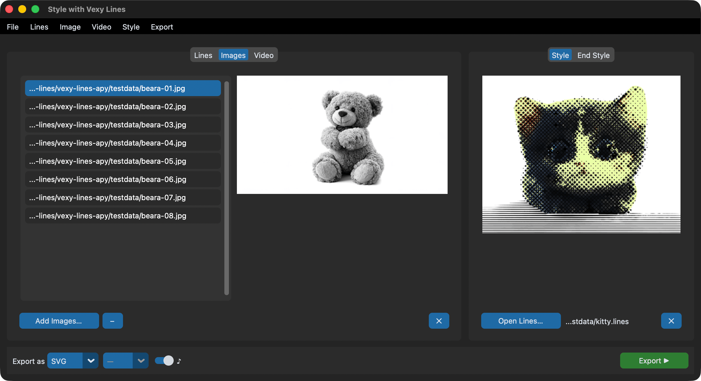
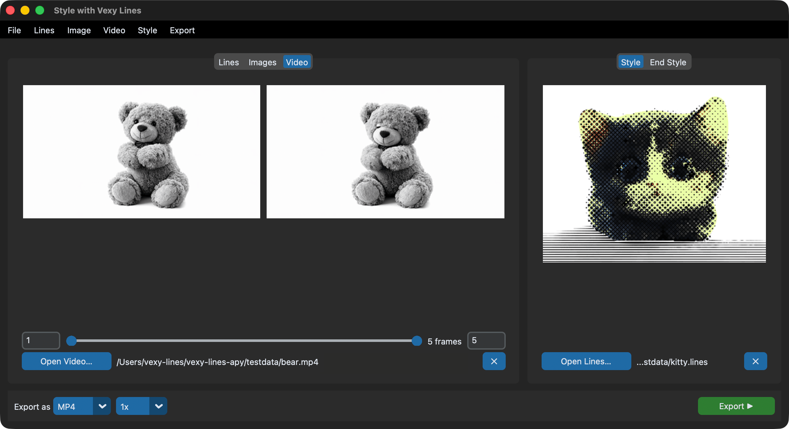

# Examples

## Launch the app

From the terminal:

```bash
vexy-lines-run
```

From Python:

```python
from vexy_lines_run import launch
launch()
```

As a module:

```bash
python -m vexy_lines_run
```

All three do the same thing: open the GUI in dark mode.

## Batch convert .lines files to SVG

You have a folder of `.lines` documents and want PNG or JPG versions of their embedded previews.


1. Switch to the **Lines** tab
2. Click **+** and select your `.lines` files (or drag them onto the file list)
3. Set format to **PNG** or **JPG**
4. Click **Export ▶** and choose an output folder
5. Each file's embedded preview image is extracted and saved

**No style needed** — Lines mode extracts previews directly from the files.

**Want plain copies?** Set format to **LINES** and the files are copied to the output folder. No MCP, no rendering — just a file copy.

**Want SVG output?** SVG export from `.lines` files isn't available in Lines mode. Instead, switch to **Images** mode, load the source images, pick a style, and export as SVG. Or use the CLI for direct MCP-based export.

## Apply a halftone style to 50 product photos

You have 50 product photos. You want them all rendered as halftone vector art.



1. Switch to the **Images** tab
2. Click **+** and select all 50 photos (PNG, JPG, WEBP — any raster format works)
3. Click **+** in the Style panel and pick a `.lines` file with the halftone look you want
4. The style preview appears immediately — check it's the right one
5. Choose **SVG** for vector output, or **PNG**/**JPG** with a size multiplier (2x doubles the resolution)
6. Click **Export ▶** and choose an output folder
7. The export button shows progress: "35% Styling product_07..."
8. Done. Fifty styled images in the output folder, named after the originals

If one photo fails (corrupt file, MCP timeout), the app logs a warning and moves on. The other 49 still export.

## Re-export .lines files with a different style

You have a collection of `.lines` documents and want to apply a completely different artistic style to all of them.

1. Switch to the **Lines** tab
2. Drag your `.lines` files onto the file list (or use **+**)
3. In the Style panel, load the new style you want to apply

Wait — the Style panel is grayed out on the Lines tab. That's by design: `.lines` files carry their own fill structure. To restyle them:

1. Extract the source images from the `.lines` files first (export as PNG from Lines mode)
2. Switch to the **Images** tab
3. Load the extracted PNGs
4. Now load the new style in the Style panel
5. Export as SVG/PNG/JPG

## Style interpolation across a sequence

Load 60 frames from an animation. Set a "clean lines" primary style and a "chaotic scribble" end style. Frame 1 gets pure clean lines, frame 60 gets pure scribble, and everything in between blends proportionally.

1. Load your frames in the **Images** tab (JPGs named `frame_001.jpg` through `frame_060.jpg`)
2. Click **+** in the Style panel and pick the clean lines style
3. Switch to the **End Style** tab and click **+** to pick the scribble style
4. Export as PNG at 2x

The blend factor `t` for frame `i` of `N` total frames is `i / (N - 1)`. Both styles must be structurally compatible — same number of groups, layers, and fills with matching fill types. If they don't match, the export will show an error.

## Create a 30-second styled video from MP4

Turn a 30-second clip into vector art, frame by frame.



1. Switch to the **Video** tab
2. Click **+** and load your `clip.mp4`
3. The first and last frames appear as previews. The range slider shows 1 to total frames.
4. For a test run, narrow the range to just 5-10 frames (drag the slider handles or type exact frame numbers)
5. Load a style in the Style panel
6. Choose **MP4** as format
7. Click **Export ▶** and pick a save location
8. The button shows progress: "3% Frame 12/450"
9. Once satisfied with a test, reset the range (Video menu > Reset Range) and export the full video

### Audio passthrough

If the source video has audio, the audio toggle (♪) appears when:
- Format is MP4
- Full frame range is selected
- You're on the Video tab

Toggle it on to keep the original audio. The app writes styled video first, then merges audio using ffmpeg. Make sure ffmpeg is on your PATH.

### Export as frame images instead

Choose **PNG** or **JPG** instead of MP4. The app saves each frame as a separate file (`frame_000001.png`, `frame_000002.png`, etc.) in the folder you choose. Useful when you want to assemble the video yourself or need individual frames for compositing.

## Process video with frame range selection

You only want frames 100–200 of a 1000-frame video:

1. Load the video on the **Video** tab
2. Type `100` in the start entry, press Enter
3. Type `200` in the end entry, press Enter
4. The previews update to show frame 100 and frame 200
5. The count label reads "101 frames"
6. Load a style and export

The frame range is 1-indexed and inclusive. Frame 100 and frame 200 are both included in the output.

Note: Audio passthrough is only available when the full frame range is selected. Partial ranges always produce silent video.

## Use style interpolation for an animated video

Combine video processing with style interpolation to create a gradually transforming effect:

1. Load a video on the **Video** tab
2. Load a "clean lines" style as the primary style
3. Switch to **End Style** and load a "scribble" style
4. The first frame gets 100% clean lines, the last frame gets 100% scribble, and everything in between blends smoothly
5. Export as MP4

This works for frame image export too — each frame file gets the interpolated style for its position in the sequence.

## Drag-and-drop workflow

Skip file dialogs entirely:

- Drag `.lines` files onto the **Lines** tab list or preview area
- Drag photos onto the **Images** tab list or preview area
- Drag a video onto the **Video** tab preview areas or path label
- Drag a `.lines` file onto the **Style** panel to load it as primary style
- Drag a `.lines` file onto the **End Style** panel to load it as end style

The app filters by extension. Dropping a PNG on the Lines tab does nothing. Dropping a duplicate file is silently ignored.

## Probe video metadata from Python

```python
from vexy_lines_run.video import probe

info = probe("clip.mp4")
print(f"Resolution: {info.width}x{info.height}")
print(f"FPS:        {info.fps}")
print(f"Frames:     {info.total_frames}")
print(f"Duration:   {info.duration:.1f}s")
print(f"Audio:      {'yes' if info.has_audio else 'no'}")
```

`probe()` reads metadata without decoding frames — it returns instantly even for large files. Requires OpenCV.

## Use the range slider widget standalone

The dual-handle range slider is a reusable CustomTkinter widget. Use it in your own apps:

```python
import customtkinter as ctk
from vexy_lines_run.widgets import CTkRangeSlider

root = ctk.CTk()
root.geometry("400x100")

def on_change(low, high):
    print(f"Range: {low:.0f} – {high:.0f}")

slider = CTkRangeSlider(
    root,
    from_=0,
    to=300,
    number_of_steps=300,  # integer steps
    command=on_change,
)
slider.pack(padx=20, pady=20, fill="x")

root.mainloop()
```

The slider supports horizontal and vertical orientations, variable binding (`tk.IntVar` / `tk.DoubleVar`), step quantization, hover highlighting, and full CustomTkinter theming (dark/light mode, custom colors).

## Run the processing pipeline from a script

For automation without the GUI, call the processing module directly:

```python
from vexy_lines_run.processing import process_export

def on_progress(current, total, message):
    print(f"[{current}/{total}] {message}")

def on_complete(message):
    print(f"Done: {message}")

def on_error(message):
    print(f"Error: {message}")

# Style transfer on a batch of images
process_export(
    mode="images",
    input_paths=["photo1.jpg", "photo2.jpg", "photo3.jpg"],
    style_path="halftone.lines",
    end_style_path=None,
    output_path="./output",
    fmt="SVG",
    size="1x",
    audio=False,
    frame_range=None,
    on_progress=on_progress,
    on_complete=on_complete,
    on_error=on_error,
)
```

This runs synchronously on the calling thread. To run in the background (like the GUI does), wrap it in a `threading.Thread`:

```python
import threading

thread = threading.Thread(
    target=process_export,
    kwargs={
        "mode": "images",
        "input_paths": ["photo1.jpg"],
        "style_path": "style.lines",
        "end_style_path": None,
        "output_path": "./output",
        "fmt": "PNG",
        "size": "2x",
        "audio": False,
        "frame_range": None,
        "on_progress": on_progress,
        "on_complete": on_complete,
        "on_error": on_error,
    },
    daemon=True,
)
thread.start()
thread.join()  # wait for completion
```

## Extract .lines previews from a script

```python
from vexy_lines_run.app import extract_preview_from_lines

image = extract_preview_from_lines("artwork.lines")
if image is not None:
    image.save("preview.png")
    print(f"Extracted {image.size[0]}x{image.size[1]} preview")
else:
    print("No preview image found in file")
```

## Process video with style objects from Python

For full control over video processing with style interpolation:

```python
from vexy_lines_run.video import process_video_with_style
from vexy_lines_apy.style import extract_style, styles_compatible

start = extract_style("clean_lines.lines")
end = extract_style("scribble.lines")

if not styles_compatible(start, end):
    print("Styles are not compatible for interpolation")
else:
    info = process_video_with_style(
        input_path="clip.mp4",
        output_path="styled_clip.mp4",
        style=start,
        end_style=end,
        start_frame=0,     # 0-based
        end_frame=150,      # 0-based, exclusive
        dpi=72,
        on_progress=lambda i, t: print(f"Frame {i}/{t}"),
    )
    print(f"Processed {info.total_frames} frames")
```

Note: `start_frame` and `end_frame` in `process_video_with_style()` are 0-based, unlike the GUI's 1-indexed display.
