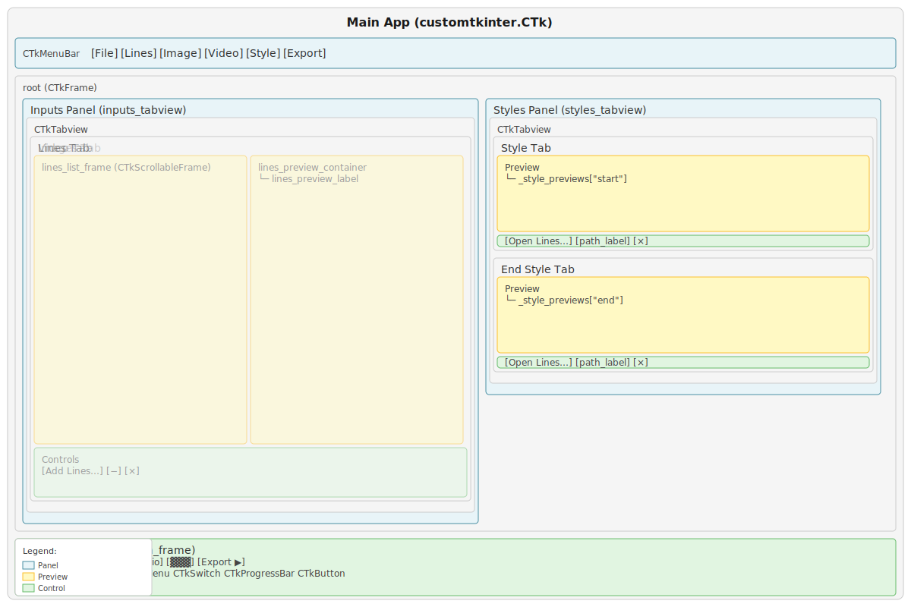

# GUI Technical Documentation

This document describes the architecture, widget structure, and implementation details of the Vexy Lines Run GUI application.

## Architecture overview

The GUI is a single-window CustomTkinter application. The `App` class owns the entire widget tree, manages internal state, and dispatches export work to a background thread via `processing.py`.

```
launch()
  └─ App.__init__()
       ├─ _build_layout()        # constructs all widgets
       ├─ _register_drop_targets()   # sets up drag-and-drop
       └─ mainloop()             # Tk event loop

User clicks Export ▶
  └─ _do_export()
       ├─ file dialog (save-as or folder)
       ├─ gather state (mode, paths, format, size, audio, range)
       ├─ disable button
       └─ threading.Thread(target=_run_export, daemon=True)
            └─ process_export(...)
                 ├─ on_progress → self.after(0, _update_progress)
                 ├─ on_complete → self.after(0, _export_complete)
                 └─ on_error   → self.after(0, _export_error)
```

The `App` class inherits from `customtkinter.CTk`. When tkinterdnd2 is available, it also mixes in `TkinterDnD.DnDWrapper` via a dynamically constructed base class tuple and a custom metaclass (`_AppMeta`).

## Widget hierarchy



### Root level

```
App (customtkinter.CTk + optional TkinterDnD.DnDWrapper)
├── CTkMenuBar
└── root (customtkinter.CTkFrame, fg_color="transparent")
    ├── inputs_tabview (CTkTabview)
    │   ├── Lines Tab
    │   │   ├── content_frame (CTkFrame)
    │   │   │   ├── lines_list_frame (CTkScrollableFrame)
    │   │   │   └── lines_preview_label (CTkLabel)
    │   │   └── controls_frame (CTkFrame)
    │   │       ├── + button (CTkButton, _choose_lines)
    │   │       ├── − button (CTkButton, _remove_selected_lines)
    │   │       └── ✕ button (CTkButton, _clear_all_lines)
    │   ├── Images Tab
    │   │   ├── content_frame (CTkFrame)
    │   │   │   ├── images_list_frame (CTkScrollableFrame)
    │   │   │   └── images_preview_label (CTkLabel)
    │   │   └── controls_frame (CTkFrame)
    │   │       ├── + button (CTkButton, _choose_images)
    │   │       ├── − button (CTkButton, _remove_selected_image)
    │   │       └── ✕ button (CTkButton, _clear_all_images)
    │   └── Video Tab
    │       ├── previews_frame (CTkFrame)
    │       │   ├── video_first_preview (CTkLabel)
    │       │   └── video_last_preview (CTkLabel)
    │       └── controls_frame (CTkFrame)
    │           ├── range_row (CTkFrame, fg_color="transparent")
    │           │   ├── video_start_entry (CTkEntry, width=60)
    │           │   ├── video_range_slider (CTkRangeSlider)
    │           │   ├── video_count_label (CTkLabel)
    │           │   └── video_end_entry (CTkEntry, width=60)
    │           └── path_row (CTkFrame, fg_color="transparent")
    │               ├── + button (CTkButton, _choose_video)
    │               ├── video_path_label (CTkLabel)
    │               └── ✕ button (CTkButton, _clear_video)
    ├── styles_tabview (CTkTabview)
    │   ├── Style Tab (key="start")
    │   │   ├── content_frame (CTkFrame)
    │   │   │   └── _style_previews["start"] (CTkLabel)
    │   │   └── controls_frame (CTkFrame)
    │   │       ├── + button (CTkButton, _choose_style_file("start"))
    │   │       ├── _style_labels["start"] (CTkLabel)
    │   │       └── ✕ button (CTkButton, _clear_style_file("start"))
    │   └── End Style Tab (key="end")
    │       ├── content_frame (CTkFrame)
    │       │   └── _style_previews["end"] (CTkLabel)
    │       └── controls_frame (CTkFrame)
    │           ├── + button (CTkButton, _choose_style_file("end"))
    │           ├── _style_labels["end"] (CTkLabel)
    │           └── ✕ button (CTkButton, _clear_style_file("end"))
    └── bottom_frame (CTkFrame)
        ├── "Export as" label (CTkLabel)
        ├── format_menu (CTkOptionMenu, values=SVG/PNG/JPG/MP4/LINES)
        ├── size_menu (CTkOptionMenu, values=—/1x/2x/3x/4x)
        ├── audio_toggle (CTkSwitch, text="♪")
        └── convert_button (CTkButton, text="Export ▶")
```

## Key components

### 1. Menu bar (`CTkMenuBar`)

Built using `CTkMenuBar` from `CTkMenuBarPlus` with `CustomDropdownMenu` for submenu support. Six cascading menus:

- **File**: Add Lines, Export ▶, Quit
- **Lines**: Add Lines, Remove Selected, Remove All Lines
- **Image**: Add Images, Remove Selected, Remove All Images
- **Video**: Add Video, Reset Range, Remove Video
- **Style**: Open Style, Open End Style, Reset Styles
- **Export**: Export ▶, Location, Format (submenu with SVG/PNG/JPG/MP4/LINES), Size (submenu with 1x/2x/3x/4x), Audio (submenu with On/Off)

Menu items call the same methods as their button counterparts. The menu helper methods (`_menu_add_lines`, `_menu_add_images`, `_menu_add_video`) first switch to the relevant tab, then open the file dialog.

### 2. Inputs panel (`inputs_tabview`)

A three-tab `CTkTabview` switching between input modes:

#### Lines tab
- **List frame**: `CTkScrollableFrame` containing `CTkLabel` widgets for each .lines file. Click to select (highlighted in blue).
- **Preview label**: Shows selected file's embedded preview image via `CTkLabel` with `CTkImage`.
- **Controls**: +, −, ✕ buttons.

#### Images tab
- **List frame**: Same structure as Lines tab, but for image files.
- **Preview label**: Shows selected image thumbnail.
- **Controls**: +, −, ✕ buttons.

#### Video tab
- **Previews**: Two side-by-side `CTkLabel` widgets showing first and last frames of the selected range.
- **Range controls**: `CTkEntry` for start frame, `CTkRangeSlider` (custom widget), frame count label, `CTkEntry` for end frame. All on a single row.
- **Path controls**: + button, path label (truncated), ✕ button.

### 3. Styles panel (`styles_tabview`)

Two-tab `CTkTabview` for start/end style selection. Each tab is built by `_build_style_picker(tab, key)` with:

- **Preview**: `CTkLabel` displaying the style's preview image.
- **Controls**: + button, truncated path label, ✕ button.

The entire panel is disabled (grayed out) when the Lines tab is active. The `_update_styles_panel_state()` method iterates through all child widgets and sets their state to `"disabled"` or `"normal"`.

### 4. Output section (`bottom_frame`)

A single horizontal frame with:

- **"Export as" label**
- **Format menu**: `CTkOptionMenu` with all five format options always visible.
- **Size menu**: `CTkOptionMenu`. Shows "—" (disabled) for SVG/LINES; shows 1x/2x/3x/4x (enabled) for raster formats.
- **Audio toggle**: `CTkSwitch` with text "♪". Visibility is conditional (see Audio Toggle Visibility below).
- **Export button**: `CTkButton`, red theme (`fg_color="#D32F2F"`, `hover_color="#B71C1C"`), text changes during export to show progress.

## Thread safety

### Background export thread

Export runs on a daemon `threading.Thread` spawned from `_do_export()`. The thread calls `process_export()` from `processing.py`, which blocks until complete.

The three callback parameters use `self.after(0, ...)` to marshal UI updates back to the main Tk thread:

```python
on_progress=lambda cur, tot, msg: self.after(0, self._update_progress, cur, tot, msg)
on_complete=lambda msg: self.after(0, self._export_complete, msg)
on_error=lambda msg: self.after(0, self._export_error, msg)
```

`self.after(0, callback)` schedules the callback on the Tk event loop's next iteration, guaranteeing it runs on the main thread. This is the only safe way to update tkinter widgets from a background thread.

### No abort mechanism

The current implementation disables the Export button during export but does not provide a way to cancel a running export. There is no `abort_event` or stop button. The button re-enables on completion or error.

### State accessed by the background thread

The background thread reads (but does not write) these attributes at spawn time via closure:

- `self._output_path`
- `self.format_var.get()`
- `self.size_var.get()`
- `self.audio_var.get()`
- `self._video_range`

Because these are read once at thread start and the UI is disabled during export, there are no race conditions.

## CustomTkinter theming

### Dark mode

`launch()` calls `customtkinter.set_appearance_mode("dark")` before creating the App. This sets the global theme to dark mode. All CustomTkinter widgets inherit the dark palette automatically.

### Color scheme

| Element | Color | Notes |
|---------|-------|-------|
| Window background | Inherited from CTk dark theme | Dark slate |
| Root frame | `fg_color="transparent"` | Inherits parent |
| Placeholder images | `#1d1f22` | Dark grey, created by `create_placeholder_image()` |
| Export button resting | `#D32F2F` fg, `#B71C1C` hover | Red theme |
| Selected file row | Blue highlight | Via CTkLabel configuration |

### Layout grid

The root frame uses a 2-column, 2-row grid:

```
Column 0 (weight=3): inputs_tabview  | Column 1 (weight=1): styles_tabview
Row 0 (weight=1):    [tabviews fill available space]
Row 1 (weight=0):    bottom_frame (spans both columns)
```

The 3:1 weight ratio gives the input panel roughly three-quarters of the width.

## CTkRangeSlider custom widget

A dual-handle range slider bundled in `widgets.py`. Ported from Akash Bora's CTkRangeSlider (version 0.3) and bundled to avoid an external dependency.

### Implementation

- **Base class**: `CTkBaseClass` from CustomTkinter's core widget classes.
- **Drawing engine**: A custom `CustomDrawEngine` class that wraps `CTkCanvas` and draws rounded rectangles for the track and circular thumbs.
- **Platform-specific rendering**:
  - macOS: `circle_shapes` (preferred) or `font_shapes`
  - Other platforms: `font_shapes` or `polygon_shapes`
- **Mouse interaction**: Binds `<Button-1>`, `<B1-Motion>`, `<ButtonRelease-1>`, `<Enter>`, `<Leave>` on the canvas. Click anywhere on the track to jump the nearest thumb. Drag to slide.
- **Value clamping**: The low thumb cannot exceed the high thumb and vice versa.
- **Step quantization**: When `number_of_steps` is set, values snap to discrete positions using `round(value * steps) / steps`.

### Integration with the Video tab

The slider is created with `from_=0, to=1` and maps to the video's frame range. When the slider value changes (`_on_video_slider_change`), the normalised 0–1 values are scaled to 1-indexed frame numbers. A `_syncing_video_controls` flag prevents update loops between the slider and the text entries.

### Variable binding

Supports two-way binding with `tk.IntVar` or `tk.DoubleVar` via the `variables` parameter (a tuple of two variables for low and high values). Variable changes update the slider, and slider changes update the variables.

## Drag-and-drop implementation

### How it works

When tkinterdnd2 is available, `_register_drop_targets()` registers multiple widgets per tab as drop targets:

1. The tab frame itself
2. The list frame (scrollable frame + its internal `_scrollable_frame`)
3. The preview label
4. For video: both preview labels and the path label

Each target gets `drop_target_register(DND_FILES)` and a `<<Drop>>` event binding to a handler (`_on_lines_drop`, `_on_images_drop`, `_on_video_drop`).

### Path parsing

Drop data from tkinterdnd2 can arrive in two formats:
- Brace-enclosed: `{/path/to/my file.png}` (paths with spaces)
- Space-separated: `/path/one.png /path/two.png`

The drop handlers parse both formats. Duplicate paths are filtered out before adding to the list.

### Graceful degradation

If tkinterdnd2 is not installed, `TkinterDnD` is set to `None` at import time, and `_register_drop_targets()` returns immediately. No error, no crash — the app simply lacks drag-and-drop. Users can still add files via buttons and menus.

## Video processing pipeline

When the GUI dispatches a video export, the processing module handles the heavy lifting:

### MP4 output (`_process_video_to_mp4`)

```
For each frame in range:
    1. Read frame from source video (OpenCV VideoCapture)
    2. Save frame as temporary PNG
    3. If end_style: interpolate style at t = frame_position / total_frames
    4. apply_style(client, style, tmp_png) → SVG string (via MCP)
    5. _svg_to_pil(svg_string, width, height) → PIL Image (via svglab or resvg-py)
    6. Convert PIL Image → OpenCV BGR frame
    7. Write frame to output (OpenCV VideoWriter, mp4v codec)
    8. Delete temporary PNG

After all frames:
    If audio and full range:
        ffmpeg -i video_only.mp4 -i original.mp4 -c:v copy -c:a aac → merged.mp4
    Else:
        Move video_only.mp4 to output path
```

### Frame image output (`_process_video_to_frames`)

Same per-frame loop but writes individual image files (`frame_000001.svg`, `frame_000001.png`, etc.) instead of feeding into a VideoWriter.

### SVG rasterisation (`_svg_to_pil`)

Two backends, tried in order:

1. **svglab**: Parses SVG, sets width/height, calls `render()`. Handles mm-unit dimensions natively.
2. **resvg-py** (fallback): Patches mm dimensions to px in the SVG string, writes to a temp file, calls `svg_to_bytes()`. Decodes PNG bytes with Pillow.

Both backends resize the result to the target dimensions with Lanczos resampling if needed.

### Audio merge

Audio passthrough uses ffmpeg as a subprocess:
```
ffmpeg -y -i video_only.mp4 -i original.mp4 -c:v copy -c:a aac -map 0:v:0 -map 1:a:0 -shortest merged.mp4
```

Audio detection uses ffprobe to check for audio streams in the source video. If ffprobe is not available, `has_audio` defaults to `False`.

## UI state transitions

### Tab switching (`_on_inputs_tab_changed`)

When switching between input tabs:
1. Update audio toggle visibility (only shown on Video tab with MP4 format and full range)
2. Update styles panel state (disabled on Lines tab, enabled on Images/Video)

Note: The format dropdown does **not** filter its options per tab. All five formats (SVG, PNG, JPG, MP4, LINES) are always available.

### Format changes (`_on_format_change`)

When the export format changes:
1. Update size dropdown: vector formats (SVG, LINES) disable it and show "—"; raster formats (PNG, JPG, MP4) enable it with 1x–4x options
2. Update audio toggle visibility

### Audio toggle visibility (`_update_audio_toggle_visibility`)

The audio switch is shown only when ALL conditions are true:
- Video tab is active
- A video is loaded with frames > 0
- The video has an audio track
- Export format is MP4
- Full video range is selected (1 to total frames)

The visibility check runs on a 300ms polling timer (`_poll_active_tab`) in addition to being called on tab and format changes.

## Responsive layout

### Resize handling

1. `<Configure>` event fires on any window resize
2. A debounced handler (`_on_resize`) schedules `_resize_refresh()` after 70ms, cancelling any pending refresh
3. `_resize_refresh()` updates:
   - Image list layout (repacks rows with new widths)
   - Lines list layout (same)
   - Path label truncation (re-calculates character limits based on widget pixel width)
   - All preview images are redrawn to fit new container sizes

### Path truncation

Two truncation functions:

**`truncate_start(text, max_chars)`** — trims leading characters:
```python
def truncate_start(text: str, max_chars: int = 20) -> str:
    if len(text) <= max_chars:
        return text
    return f"…{text[-max_chars:]}"
```

**`truncate_middle(text, max_width)`** — replaces the middle with "⋮":
```python
def truncate_middle(text: str, max_width: int) -> str:
    if len(text) <= max_width:
        return text
    keep = max_width - 1
    left = keep // 2
    right = keep - left
    return f"{text[:left]}⋮{text[-right:]}"
```

Font metrics are computed at init time using `tkfont.nametofont()` on the default CTkLabel font, enabling pixel-accurate truncation calculations.

## State management

### Internal state variables

| Variable | Type | Description |
|----------|------|-------------|
| `_style_paths` | `dict[str, str \| None]` | Maps `"start"`/`"end"` to file paths |
| `_style_labels` | `dict[str, CTkLabel]` | Path display labels per style slot |
| `_style_previews` | `dict[str, CTkLabel]` | Preview image labels per style slot |
| `_style_default_text` | `dict[str, str]` | Placeholder text: `{"start": "Style", "end": "End Style"}` |
| `_image_paths` | `list[str]` | Image file paths |
| `_image_rows` | `list[CTkLabel]` | Row widgets in the image list |
| `_selected_image_index` | `int \| None` | Currently selected image index |
| `_lines_paths` | `list[str]` | Lines file paths |
| `_lines_rows` | `list[CTkLabel]` | Row widgets in the lines list |
| `_selected_lines_index` | `int \| None` | Currently selected lines index |
| `_video_path` | `str` | Current video file path (empty string if none) |
| `_video_total_frames` | `int` | Total frame count of loaded video |
| `_video_has_audio` | `bool` | Whether the loaded video has an audio stream |
| `_video_range` | `tuple[int, int]` | Selected frame range (1-indexed, inclusive) |
| `_syncing_video_controls` | `bool` | Guard flag to prevent update loops |
| `_output_path` | `str` | Last selected output path |

### Tkinter variables

| Variable | Type | Description |
|----------|------|-------------|
| `format_var` | `tk.StringVar` | Current export format, initial value `"SVG"` |
| `size_var` | `tk.StringVar` | Current size multiplier, initial value `"—"` |
| `audio_var` | `tk.BooleanVar` | Include audio, initial value `True` |

## Window lifecycle

### Initialization

`App.__init__()` calls, in order:
1. `super().__init__()` — creates the Tk window
2. TkinterDnD initialization (if available)
3. Window configuration: title, geometry (900x700), minsize (960x480)
4. State variable initialization
5. Font metrics setup for truncation
6. `_build_layout()` — constructs all widgets
7. `_register_drop_targets()` — sets up drag-and-drop
8. Initial state updates (size dropdown, audio toggle, styles panel)
9. `<Configure>` event binding for resize handling
10. Raise to front: `lift()`, `attributes("-topmost", True)`, then after 200ms set `-topmost` back to `False`

### Launch

`launch()` sets dark appearance mode, creates the App, lifts it again (belt and suspenders), and enters `mainloop()`.

## Key method architecture

### Layout builders
- `_build_layout()` — top-level structure (root frame, grid)
- `_build_menu_bar()` — menu construction with CTkMenuBar
- `_build_inputs_panel()` — tabview with three tabs
- `_build_lines_tab()` — lines-specific widgets
- `_build_images_tab()` — image-specific widgets
- `_build_video_tab()` — video-specific widgets
- `_build_styles_panel()` — style tabview with two tabs
- `_build_style_picker()` — reusable per-slot style picker
- `_build_outputs_section()` — export controls bar

### Export flow
- `_do_export()` — file dialog, gather state, spawn thread
- `_run_export()` — background thread entry point
- `_update_progress()` — update button text with percentage (main thread)
- `_export_complete()` — re-enable button (main thread)
- `_export_error()` — re-enable button, show error dialog (main thread)

### Video range management
- `_set_video_range()` — validates and sets range, updates slider/entries/previews
- `_on_video_slider_change()` — handles slider input, converts normalised values to frame numbers
- `_on_video_entries_submit()` — handles text entry input (Return key or focus-out)
- `_syncing_video_controls` — flag to prevent circular updates between slider and entries

### Image management
- `_set_label_image()` — fits and sets a PIL image on a CTkLabel
- `fit_image_to_box()` — aspect-ratio-preserving scale onto a dark canvas
- `_redraw_*_preview()` — refresh specific preview widgets after selection or resize

## File extension constants

Defined at module level:

```python
IMAGE_EXTENSIONS = {".png", ".jpg", ".jpeg", ".gif", ".bmp", ".tiff", ".webp"}
VIDEO_EXTENSIONS = {".mp4", ".mov", ".avi", ".mkv", ".webm"}
LINES_EXTENSIONS = {".lines"}
```

## Dependencies

### Required (installed with the package)

| Package | Purpose |
|---------|---------|
| `customtkinter` | Modern tkinter wrapper with dark mode |
| `CTkMenuBarPlus` | Enhanced menu bar with cascading dropdown menus |
| `Pillow` (PIL) | Image loading, thumbnails, format conversion |
| `loguru` | Debug logging |
| `vexy-lines-apy` | MCP client and style engine bindings |

### Required for video processing

| Package | Purpose |
|---------|---------|
| `opencv-python-headless` (cv2) | Video frame reading and writing |
| `svglab` or `resvg-py` | SVG-to-raster conversion |
| `numpy` | Array conversion between PIL and OpenCV |

### Optional

| Package | Purpose |
|---------|---------|
| `tkinterdnd2` | Drag-and-drop support. Falls back gracefully if missing. |
| `ffmpeg` (system binary) | Audio track merging for MP4 output |
| `ffprobe` (system binary) | Audio stream detection in source videos |
