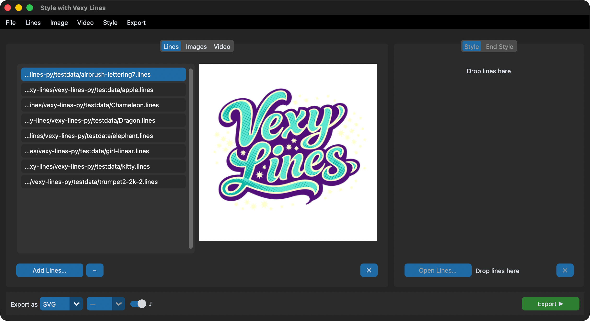

[Vexy Lines for Mac & Windows](https://vexy.art/lines/) | [Download](https://www.vexy.art/lines/#buy) | [Buy](https://www.vexy.art/lines/#buy) | **Batch GUI** | [CLI/MCP](https://vexy.dev/vexy-lines-cli/) | [API](https://vexy.dev/vexy-lines-apy/) | [.lines format](https://vexy.dev/vexy-lines-py/)

# vexy-lines-run

Drop images in. Pick a style. Get vector art out.



**vexy-lines-run** is a desktop batch GUI for [Vexy Lines](https://vexy.art) style transfer. Feed it images, `.lines` documents, or video. Choose an artistic style. Export as SVG, PNG, JPG, or MP4. Built on CustomTkinter — runs on macOS, Windows, and Linux.

- [On Github](https://github.com/vexyart/vexy-lines-run)
- [On PyPI](https://pypi.org/project/vexy-lines-run/)

## Running Vexy Lines Run

### macOS

Open Terminal, paste, press Enter:

```sh
curl -LsSf https://astral.sh/uv/install.sh | sh && "$HOME/.local/bin/uvx" --python 3.12 vexy-lines-run@latest
```

### Windows

Open Command Prompt, paste, press Enter:

```bat
powershell -ExecutionPolicy ByPass -c "irm https://astral.sh/uv/install.ps1 | iex; $env:Path = \"$HOME\.local\bin;$HOME\AppData\Roaming\uv;$env:Path\"; uvx --python 3.12 vexy-lines-run@latest"
```

### From Python

```python
from vexy_lines_run import launch
launch()
```

## Three tabs, one workflow

| Tab | Input | What happens |
|-----|-------|-------------|
| **Lines** | `.lines` files | Re-export with a different style, or extract embedded previews |
| **Images** | PNG, JPG, WEBP, BMP, TIFF, GIF | Apply vector fill patterns through the MCP engine |
| **Video** | MP4, MOV, MKV, AVI, WEBM | Style transfer frame-by-frame with audio passthrough |

Pick a primary style from any `.lines` file. Optionally pick an end style — the app interpolates between them across the input sequence for smooth transitions.

## What you get

- **Style picker** with live thumbnail previews
- **Style interpolation** — blend two styles across a batch or video
- **Drag-and-drop** onto any panel
- **Background export** with a live progress bar and cancel button
- **Output formats:** SVG, PNG, JPG (1x–4x upscale), MP4, LINES
- **Keyboard shortcuts** — Cmd/Ctrl+O, Cmd/Ctrl+E, Escape
- **Native menu bar**
- **Dark mode** follows your system appearance

## Next steps

- [Installation](installation.md) — platform notes, dev setup
- [GUI Guide](gui-guide.md) — what every button does, with screenshots
- [Examples](examples.md) — real workflows, step by step
- [API Reference](api-reference.md) — Python API for App, processing, video, and widgets
- [Changelog](changelog.md) — release history
